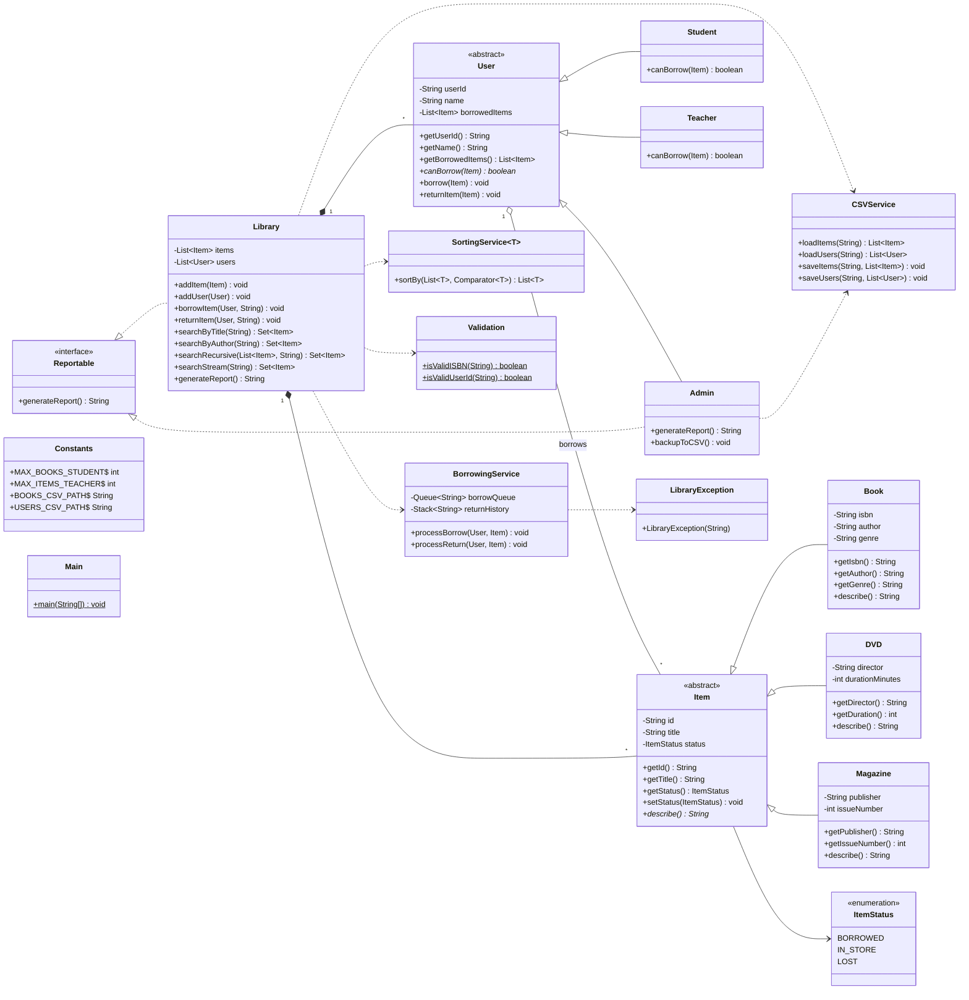

# Library Management System — Class Diagram

**Student:** Kian Dehghani
**Student ID:** STUDENT_ID

## Notes
- `Item` and `User` are abstract base classes.
- `Reportable` interface is implemented by `Admin` and `Library`.
- `SortingService<T>` is generic and supplies different sorting strategies via `Comparator<T>`.
- `BorrowingService` uses a `Queue` (pending borrows) and a `Stack` (return history); search results return a `Set` to dedupe copies.
- `LibraryException` is thrown on invalid borrow/return operations (limit exceeded, all copies out, etc.).
