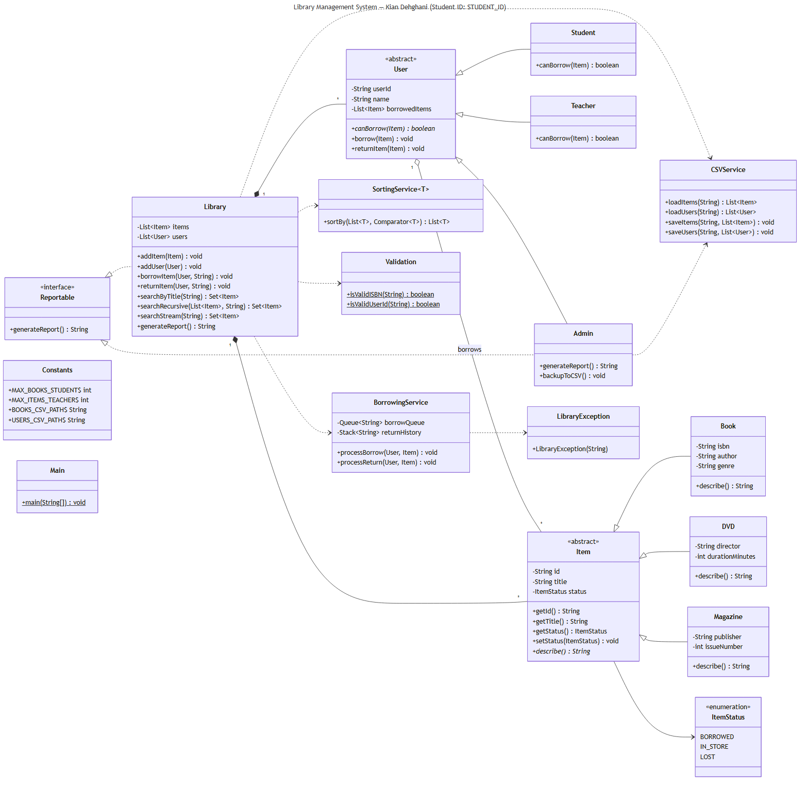

# FinalProject_SchoolSystem

Library Management System — Java project.

**Student:** Kian Dehghani

## Overview

A console-based Library Management System that supports borrowing, returning,
searching and reporting on books, DVDs and magazines. Three user roles —
`Student`, `Teacher` and `Admin` — share an inheritance hierarchy with `User`,
and item types share an inheritance hierarchy with `Item`. Data persists to
CSV files.

Class diagram (Deliverable 1):



## Project Layout

```
src/main/java/com/library
  domain/      Item, Book, DVD, Magazine, User, Student, Teacher, Admin, Library, ItemStatus
  service/     CSVService, BorrowingService, SortingService
  util/        Constants, Validation, LibraryException
  interfaces/  Reportable
  Main.java
src/main/resources
  books.csv, users.csv
src/test/java/com/library
  ... JUnit 5 tests for domain, service and util
```

## Build and Run

```
mvn compile
mvn test
mvn exec:java -Dexec.mainClass=com.library.Main
```

## CLI

After launch the system loads `books.csv` and `users.csv` and prints a menu:

```
1) Search by title
2) Borrow item
3) Return item
4) Report
5) Backup to CSV
6) List items sorted by title
0) Quit
```

## Borrow rules

- Students may borrow up to **5** books and only books.
- Teachers may borrow up to **10** items of any type.
- Admins may not borrow; they generate reports and trigger CSV backup.

## Validation

- ISBN must be exactly 13 digits.
- User IDs must start with an uppercase letter and contain only uppercase
  letters and digits (length ≥ 3).
